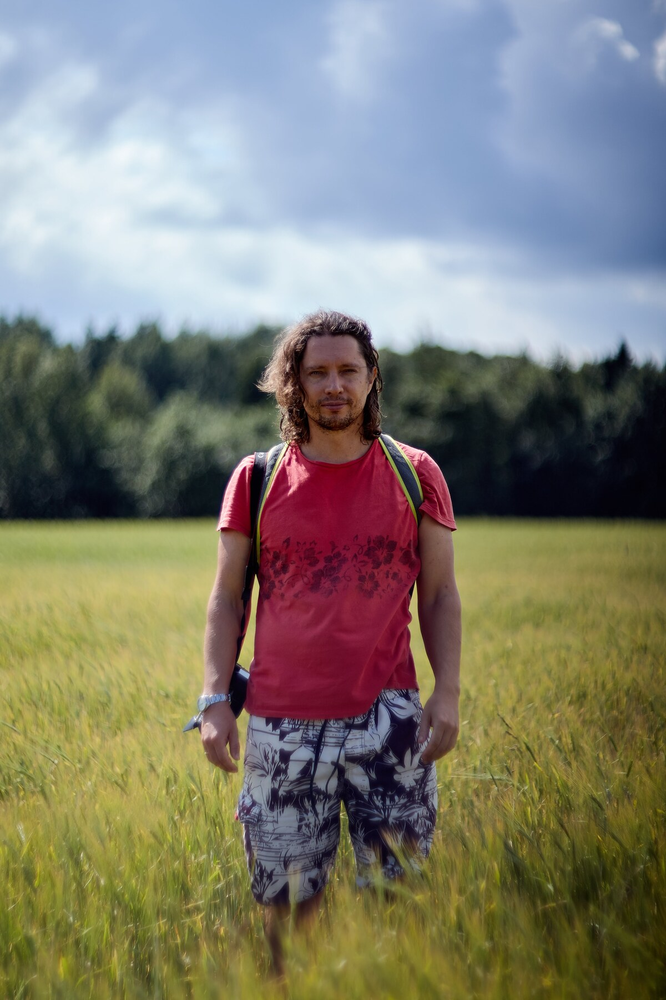

# image-prompt

[](https://github.com/vearutop/image-prompt/actions?query=branch%3Amaster+workflow%3Atest-unit)
[](https://codecov.io/gh/vearutop/image-prompt)
[](https://pkg.go.dev/github.com/vearutop/image-prompt)
[](https://wakatime.com/badge/github/vearutop/image-prompt)


CLI tool and a library to ask LLMs about local and remote JPG images.

## Install

```
go install github.com/vearutop/image-prompt@latest
$(go env GOPATH)/bin/image-prompt --help
```

Or download binary from [releases](https://github.com/vearutop/image-prompt/releases).

### Linux AMD64

```
wget https://github.com/vearutop/image-prompt/releases/latest/download/linux_amd64.tar.gz && tar xf linux_amd64.tar.gz && rm linux_amd64.tar.gz
./image-prompt -version
```

### Macos Intel

```
wget https://github.com/vearutop/image-prompt/releases/latest/download/darwin_amd64.tar.gz && tar xf darwin_amd64.tar.gz && rm darwin_amd64.tar.gz
codesign -s - ./image-prompt
./image-prompt -version
```

### Macos Apple Silicon (M1, etc...)

```
wget https://github.com/vearutop/image-prompt/releases/latest/download/darwin_arm64.tar.gz && tar xf darwin_arm64.tar.gz && rm darwin_arm64.tar.gz
codesign -s - ./image-prompt
./image-prompt -version
```


## Usage

```
Usage of image-prompt:
  -cf string
        CloudFlare worker URL (example https://MY_AUTH_KEY@llava.xxxxxx.workers.dev/)
  -gemini string
        Gemini API KEY
  -model string
        model name
  -openai string
        OpenAI API KEY
  -prompt string
        prompt (default "Generate a detailed caption for this image, don't name the places or items unless you're sure.")
```

## Example

### Google gemini-2.0-flash

```
image-prompt -prompt "What is this image about?" -gemini $GEMINI_API_KEY IMG_7452.1200w.jpg
The image shows a man standing in a field of tall green grass. He is wearing a red t-shirt, patterned shorts, and a backpack. Behind him, there is a line of trees and a cloudy sky. He appears to be outdoors, possibly hiking or exploring.
```

### OpenAI gpt-4o-mini

```
image-prompt -prompt "What is this image about?" -openai $OPENAI_KEY IMG_7452.1200w.jpg
```

The image depicts a man standing in a grassy field, wearing a red t-shirt and patterned shorts, with a backpack and a camera. The background features trees and a partly cloudy sky, indicating an outdoor setting, possibly in nature or a park. The composition suggests a moment of exploration or reflection in a natural environment.

### Ollama llava:13b

```
image-prompt -prompt "What is this image about?" -model llava:13b IMG_7452.1200w.jpg
```

The image shows a person standing in a field of tall grass, wearing a red top and a backpack. It appears to be an outdoor scene, possibly during the summer given the lush greenery around. The individual seems relaxed and casual, posing for the photographer. The background features a clear sky with some clouds and what looks like trees or bushes in the distance, which could suggest a rural setting. Without more context, it's difficult to determine the exact purpose of this image beyond a casual snapshot of someone enjoying an outdoor activity or journey.

### CloudFlare AI worker @cf/llava-hf/llava-1.5-7b-hf

```
image-prompt -prompt "What is this image about?" -cf https://<redacted>@llava.<redacted>.workers.dev/ IMG_7452.1200w.jpg
The image features a man standing in a field, wearing a red shirt and shorts. He is holding a camera, possibly preparing to take a photograph or record a video. The man appears to be enjoying his time outdoors, surrounded by the natural environment.
```


