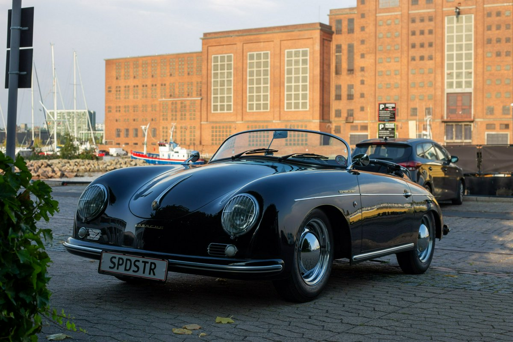

# CloudFlare AI worker to prompt images

CloudFlare provides free AI workers with limited renewable quotas that can be sufficient for personal projects.

These AI workers can run many [preinstalled models](https://developers.cloudflare.com/workers-ai/models/), including `@cf/llava-hf/llava-1.5-7b-hf` that can "see" images.

## Step by step setup

Register/login to [CloudFlare](https://dash.cloudflare.com/).

Create and deploy "Hello world" worker with name `llava`, name can be anything, but it will be part of resulting url.


Edit code and copy paste contents of [`llava_worker.js`](./llava_worker.js). Change `MY_AUTH_KEY` to some secret random string.


Get to worker settings and add bindings.


Add Workers AI with an `AI` var name.


Test with curl if all works.



```
curl --data-binary '@p0v2msmyzgom.1200w.jpg' -H "Authorization: MY_AUTH_KEY" -H "Prompt: Write a short fairy tale based on the picture" https://llava.xxxxxx.workers.dev/
```

```json
{"description":" In a land filled with beauty, there lived a car named Spot. Spot was a sleek black sports car, and it loved to drive around the town, exploring the streets and admiring the buildings. One day, as Spot was cruising down the road, it noticed a majestic building with a large window. Spot was intrigued and decided to stop and take a closer look. As it approached the building, it noticed a beautiful princess sitting by the window, waiting for her prince to arrive. Spot, being a kind and gentle car, wanted to help the princess, so it offered to take her on a magical journey to find her prince. The princess was overjoyed and climbed into Spot's passenger seat, and they set off on their adventure. Along the way, they encountered various challenges, but Spot's speed and agility helped them overcome them all. Finally, they arrived at the palace, where the prince was waiting. The prince was overjoyed to see the princess, and they were reunited in a grand celebration. From that day on, Spot was known as the car that brought happiness and love to the town.","elapsedTimeMs":19229,"prompt":"Write a short fairy tale based on the picture","model":"@cf/llava-hf/llava-1.5-7b-hf","fileSize":189605}
```