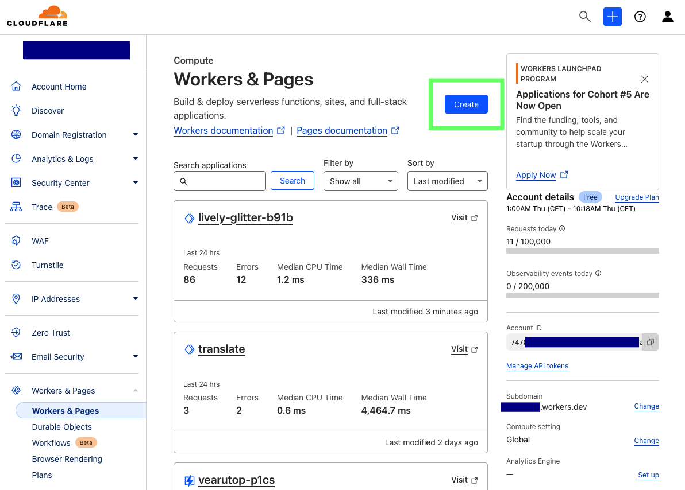
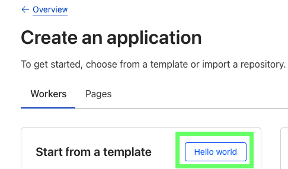
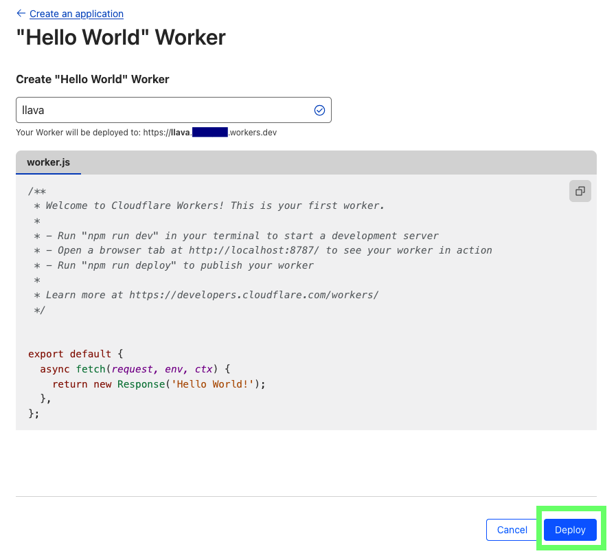
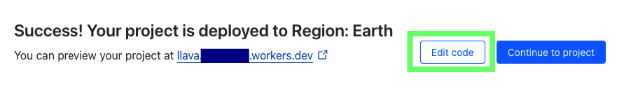
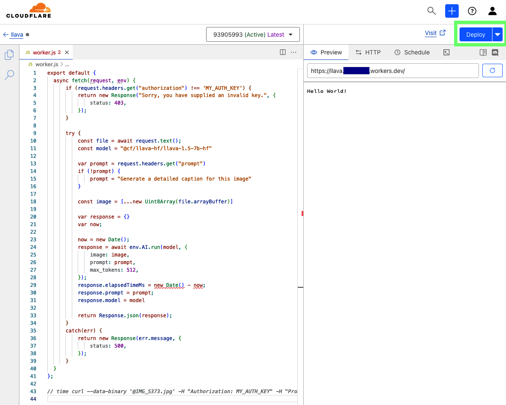
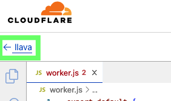
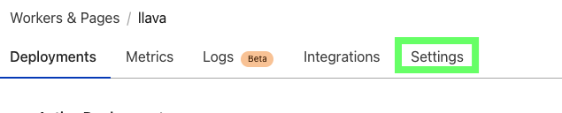
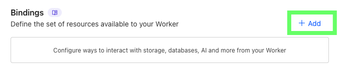
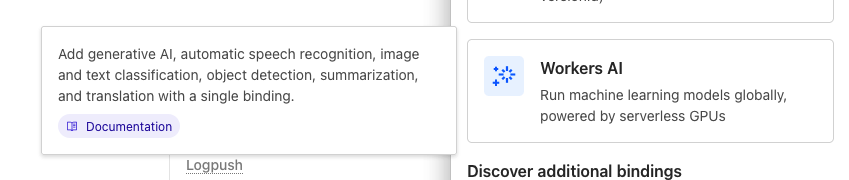
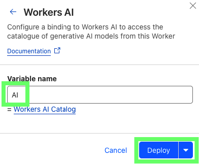

# CloudFlare AI worker to prompt images

CloudFlare provides free AI workers with limited renewable quotas that can be sufficient for personal projects.

These AI workers can run many [preinstalled models](https://developers.cloudflare.com/workers-ai/models/), including `@cf/llava-hf/llava-1.5-7b-hf` that can "see" images.

## Step by step setup

Register/login to [CloudFlare](https://dash.cloudflare.com/).

Create and deploy "Hello world" worker with name `llava`, name can be anything, but it will be part of resulting url.





Edit code and copy paste contents of [`llava_worker.js`](./llava_worker.js). Change `MY_AUTH_KEY` to some secret random string.




Get to worker settings and add bindings.





Add Workers AI with an `AI` var name.




Test with curl if all works.

```
curl --data-binary '@p0v2msmyzgom.1200w.jpg' -H "Authorization: MY_AUTH_KEY" -H "Prompt: Write a short fairy tale based on the picture" https://llava.xxxxxx.workers.dev/
```

```json
{"description":" Once upon a time, in a faraway land, there lived a beautiful princess named Rose. She had long, golden hair and sparkling blue eyes. She was loved by all who knew her, and she lived in a grand castle with her parents, the king and queen.\n\nOne day, while out for a walk in the forest, Rose came across a strange, glowing object. It was a magical mirror, and when she looked into it, she saw her own reflection. But something was different - her reflection had a twin sister who looked exactly like her, but with a few subtle differences.\n\nRose was fascinated by the mirror and spent hours looking at her reflection, trying to figure out what made her twin sister different. She noticed that her twin sister had a slightly different shade of pink on her cheeks, and her hair was styled slightly differently.\n\nAs she continued to look at the mirror, she began to feel a strange sensation - she was being pulled into the mirror. Before she knew it, she had fallen into a magical world, where everything was upside down and backwards.\n\nRose was terrified, but she didn't give up. She searched for a way out of the magical world, but she couldn't find it. Just when she was about to give up hope, she saw her twin sister walking towards her.\n\nTo her surprise, her twin sister was also in the magical world, and she had been looking for her too. Together, they searched for a way out, and finally, they found a magical key that unlocked the door to the real world.\n\nRose and her twin sister were reunited with their parents, and they all lived happily ever after. But Rose never forgot the magical mirror and the lesson it taught her - that sometimes, the most important things in life are the things that are different.","elapsedTimeMs":29052,"prompt":"Write a short fairy tale based on the picture","model":"@cf/llava-hf/llava-1.5-7b-hf"}
```